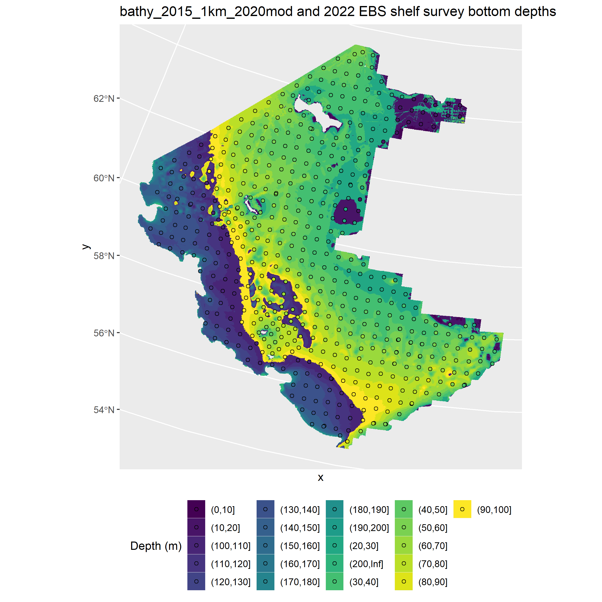
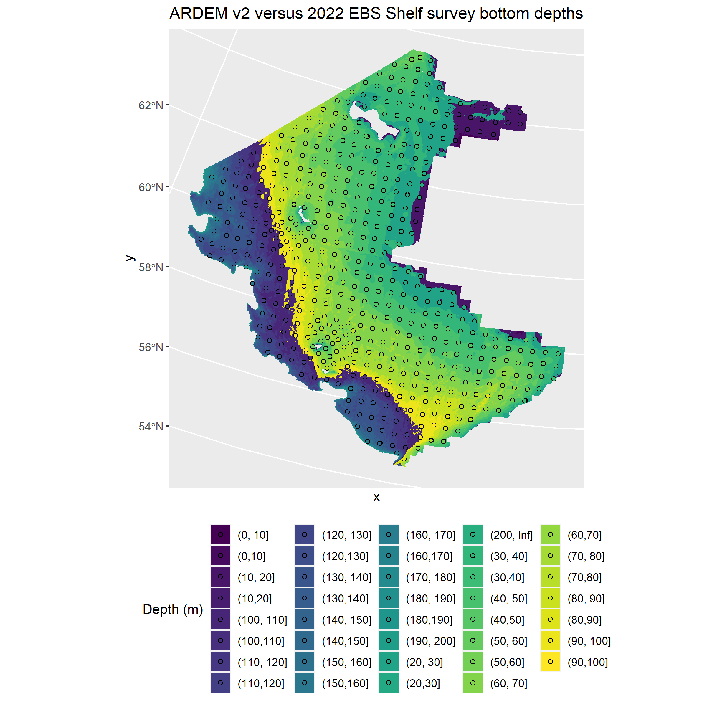

# efhbathy

The ARDEM netCDF file is too large for GitHub. Download it from [http://research.cfos.uaf.edu/bathy/](http://research.cfos.uaf.edu/bathy/) and save it to the /data/ directory after cloning.

See /plots/ directory for all plots.

